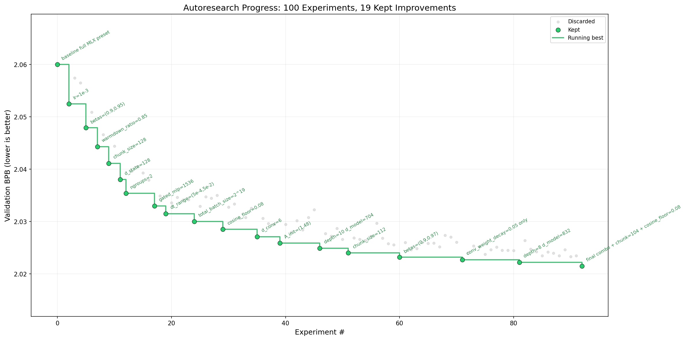

# autoresearch-mamba



Karpathy-style autoresearch for a Mamba2 language model.

The repository keeps the same basic loop as `autoresearch-karpathy`: a fixed evaluator, a fixed 5-minute training budget, and a single training file that the agent is allowed to mutate in search of a lower `val_bpb`.

For background on the Mamba architecture itself, see Wikipedia: https://en.wikipedia.org/wiki/Mamba_(deep_learning_architecture)

## Roadmap

- [ ] a Mamba-3 implementation is planned soon
- [ ] a hybrid Mamba-Transformer MoE direction is planned soon as a separate future architecture track
- [ ] this repository currently remains focused on the Mamba-2-style autoresearch target
- [ ] for background on Mamba-3, see Together AI's March 17, 2026 overview: https://www.together.ai/blog/mamba-3
- [ ] for background on an open hybrid Mamba-Transformer MoE design, see NVIDIA's Nemotron 3 Super overview from March 11, 2026: https://developer.nvidia.com/blog/introducing-nemotron-3-super-an-open-hybrid-mamba-transformer-moe-for-agentic-reasoning/

## Goal

The target is simple:

- minimize `val_bpb`
- under a fixed `TIME_BUDGET = 300` seconds
- without changing the evaluation harness for the active run

For the MLX path, the canonical fixed evaluator lives in `prepare_mlx.py`, and the editable experiment surface lives in `train_mamba_mlx.py`.

## Canonical Path

The intended primary workflow is Apple Silicon + MLX:

- `prepare_mlx.py`: fixed data prep, tokenizer, dataloader, evaluator
- `train_mamba_mlx.py`: editable Mamba2 training script
- `program.md`: instructions for an autonomous agent running the autoresearch loop

The PyTorch/CUDA files are included as a secondary/reference path:

- `prepare.py`
- `train_mamba.py`

## Repository Layout

- `program.md`: autoresearch instructions and keep/discard loop
- `prepare_mlx.py`: fixed MLX prep/eval harness
- `train_mamba_mlx.py`: MLX Mamba2 experiment target
- `prepare.py`: fixed PyTorch prep/eval harness
- `train_mamba.py`: PyTorch Mamba2 experiment target
- `analysis.ipynb`: notebook for analyzing `results.tsv` and plotting progress
- `pyproject.toml`: Python dependencies
- `mlx_preset.local.json`: optional local MLX override file, ignored by git

## Install

This repo uses a minimal `pyproject.toml`.

Example:

```bash
python3 -m venv .venv
source .venv/bin/activate
pip install -e .
```

The MLX path requires Apple Silicon and a working MLX installation.

The optional analysis notebook uses `pandas` and `matplotlib`, which are not part of the minimal core dependency set in `pyproject.toml`.

## Platform Support

The canonical path in this repo is Apple Silicon + MLX.

- `Local preset`: validated on Apple Silicon with tighter memory budgets, including an `M1 Pro` using `mlx_preset.local.json`
- `Full tracked MLX baseline`: intended for a higher-memory Apple Silicon machine; the practical target is roughly an `M4 Max` class system with `128 GB` unified memory, or something with similar headroom
- `PyTorch path`: secondary/reference path for CUDA systems via `prepare.py` and `train_mamba.py`

If you do not have the memory budget for the full MLX baseline, use the local preset and keep that preset fixed for the entire run.

## Data And Cache

Data and tokenizer artifacts are stored in:

```bash
~/.cache/autoresearch/
```

This includes:

- downloaded data shards
- trained tokenizer
- `token_bytes.npy` for BPB evaluation

## Quick Start

**Requirements:** Python `3.10+`, Apple Silicon, and a working MLX install for the canonical path.

### Full MLX Baseline

Prepare data:

```bash
python3 prepare_mlx.py
```

Run the baseline:

```bash
python3 train_mamba_mlx.py
```

### Local Apple Silicon Preset

For smaller local testing, use the optional preset file:

```bash
AUTORESEARCH_MLX_PRESET_FILE=mlx_preset.local.json python3 prepare_mlx.py
AUTORESEARCH_MLX_PRESET_FILE=mlx_preset.local.json python3 train_mamba_mlx.py
```

Important:

- `mlx_preset.local.json` is for local testing
- it is ignored by git
- if you use it for a run, treat it as fixed infrastructure for that entire run
- do not compare `val_bpb` from the local preset directly against the full preset, because the evaluation setup differs

If the commands above work, your setup is working and you can move into autonomous research mode.

## Running The Agent

Open your coding agent in this repo, point it at `program.md`, and let it run the keep/discard loop.

Example prompt:

```text
Hi, read program.md and start the autoresearch setup on the MLX path. Use the active preset as fixed infrastructure, run one experiment at a time, log results to results.tsv, and keep or discard changes based on val_bpb.
```

The intended flow is:

- the human controls `program.md`
- the agent edits `train_mamba_mlx.py`
- `prepare_mlx.py` stays fixed for the active run
- `val_bpb` decides whether an experiment is kept or discarded

For local testing, be explicit about the preset in the prompt:

```text
Use AUTORESEARCH_MLX_PRESET_FILE=mlx_preset.local.json for this entire run. Do not switch presets mid-run and do not mix these results with the full baseline results.tsv history.
```

## What The Agent Is Allowed To Change

During an autoresearch run, the intended editable file is:

- `train_mamba_mlx.py`

Typical experiment directions:

- model size: depth, width, state dimension, head dimension
- SSM structure: `d_state`, `d_conv`, `expand`, `ngroups`, SSD chunk size
- training setup: batch size, grad accumulation, LR schedule, Adam betas, weight decay
- initialization: `dt` range, `A` range, output projection scaling
- optional architectural ablations: MLP branch, residual scaling, activation choices, tied vs untied output weights

The evaluator and run budget should stay fixed for the active run.

## What Stays Fixed

For a given run:

- `prepare_mlx.py` should be treated as read-only
- the active preset choice should stay fixed
- `evaluate_bpb` is the ground-truth metric
- `TIME_BUDGET` stays at 300 seconds

The working rule is: change the training recipe, not the benchmark definition.

## Output

A successful run prints a summary including:

```text
val_bpb
training_seconds
total_seconds
total_tokens_M
num_steps
num_params_M
depth
```

Lower `val_bpb` is better.

## Results Logging

`program.md` uses a simple keep/discard loop:

- run an experiment
- read `val_bpb`
- keep the commit if `val_bpb` improved
- otherwise discard/revert it
- log the result in `results.tsv`

Do not mix full-preset and local-preset runs in the same results log.

## Current Status

The repository is set up to evaluate the same kind of agent capability as Karpathy's autoresearch, but on a Mamba2-style architecture instead of a GPT-style architecture.

Current state:

- MLX path is the canonical autoresearch path
- local MLX preset has been validated end-to-end on Apple Silicon
- PyTorch path is present as a secondary/reference implementation
- the repo is suitable for fixed-budget `val_bpb` optimization experiments on Mamba
- the implemented architecture target is Mamba-2-style, not Mamba-3

## Notes

- This is a compact research harness, not the full upstream `mamba_ssm` codebase
- the model follows the Mamba-2 / SSD design used by the `mamba2.py` reference, not the separate Mamba-3 codepaths
- as of 2026, the broader Mamba family is prominent in long-sequence, audio, vision, and bioinformatics settings, and remains attractive for low-latency inference-heavy systems
- Mamba-3 itself has already been released as an open-source SSM architecture and is starting to be benchmarked against Transformer baselines, even though this repository does not implement it yet
- the objective is not to reproduce every upstream runtime detail
- the objective is to create a clean autoresearch target for Mamba under a fixed evaluator and fixed budget

For autonomous experimentation instructions, read `program.md`.
